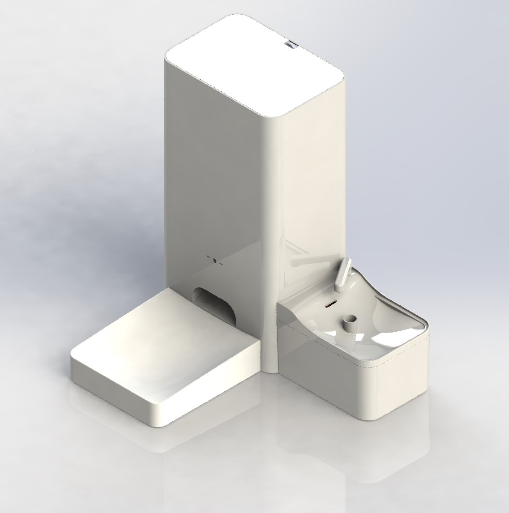

# PetVet - Smart Feeder / PetVet - Evcil Hayvan Besleme Makinesi

Copyright (c) 2024 Samed Kaya
@samed5497

- PetVet, Evcil hayvanınızın beslenme programını otomatik bir şekilde yapmanızı sağlayan akıllı bir mama ve su kabıdır.

## English

### Project Overview
This project is an automated pet feeding machine designed to manage feeding schedules, water distribution, and monitor food and water levels. The machine is controlled via an ESP32 microcontroller and can be managed remotely using an Android application that interfaces with Firebase Realtime Database. The machine is intended to ensure that pets are fed and hydrated consistently, even when their owners are away.

### Features
- **Automated Feeding**: Schedule up to 10 feeding times per day with customizable portion sizes.
- **Water Distribution**: Automatically or manually dispense water based on predefined schedules or real-time commands.
- **Real-time Monitoring**: Continuously monitor food and water levels using sensors, with alerts for low levels.
- **Remote Control**: Manage and monitor the machine remotely through an Android application that communicates with Firebase.
- **Alarm System**: Receive alerts in case of system errors or abnormal conditions, such as water overflow or food dispenser malfunction.
- **Manual Override**: Allow manual feeding and water distribution through physical buttons or the mobile app.
- **Resilience to Power Interruptions**: The system is designed to retain settings and continue operation seamlessly after a power interruption.

### Components
- **ESP32 Microcontroller**: The core of the system, handling all operations and communication with Firebase.
- **RTC Module**: Ensures that time-based operations continue accurately even after power loss.
- **Food and Water Sensors**: Monitor the levels of food and water in the respective containers.
- **Motors and Actuators**: Control the dispensing of food and water.
- **Android Application**: Provides an interface for users to manage feeding schedules, monitor levels, and control the machine remotely.
- **Firebase Realtime Database**: Stores user settings, feeding schedules, and real-time data from the machine.

### Setup and Configuration
1. **Hardware Assembly**:
   - Connect the food dispenser and water pump to the designated motor pins on the ESP32.
   - Set up the sensors for food and water level monitoring.
   - Install the RTC module and connect it to the ESP32.

2. **Software Installation**:
   - Clone this repository to your local machine.
   - Open the project in VS Code with PlatformIO installed.
   - Upload the code to the ESP32.

3. **Android Application**:
   - Install the PetVet Android app.
   - Connect to the ESP32 via Wi-Fi for initial setup.
   - Enter your Wi-Fi credentials and Firebase information through the app.
   - Once connected, the app will display real-time data from the machine and allow for remote management.

4. **Firebase Configuration**:
   - Set up a Firebase Realtime Database.
   - Update the Firebase credentials in the ESP32 code.
   - Structure the Firebase database according to the provided JSON schema.

### Usage
- **Scheduling Feeding Times**: Use the Android app to set feeding times and portion sizes. The machine will automatically dispense food according to the schedule.
- **Manual Feeding**: Press the physical button on the machine or use the app to manually dispense food or water.
- **Monitoring**: Check food and water levels via the app, which updates in real-time based on sensor readings.
- **Alarms and Alerts**: The machine will send alerts to the app in case of any issues, such as low water or food levels or motor malfunctions.

### Troubleshooting
- **ESP32 Reboots**: If the ESP32 reboots frequently, check the power supply and ensure that the watchdog timer is properly managed in the code.
- **Sensor Malfunction**: If the sensors are not reading correctly, recalibrate them and ensure proper connections.
- **Firebase Connection Issues**: Verify your Firebase credentials and ensure that the ESP32 has a stable internet connection.

### Contributing
Contributions to improve the project are welcome. Please fork the repository and submit a pull request with your changes.

### License
This project is licensed under the MIT License - see the [LICENSE](LICENSE) file for details.

---

## Türkçe

### Proje Özeti
Bu proje, beslenme programlarını yönetmek, su dağıtımını sağlamak ve mama ve su seviyelerini izlemek için tasarlanmış otomatik bir evcil hayvan besleme makinesidir. Makine, bir ESP32 mikrodenetleyici ile kontrol edilir ve Firebase Realtime Database ile arayüz oluşturan bir Android uygulamasıyla uzaktan yönetilebilir. Makine, evcil hayvanların sahipleri uzaktayken bile düzenli olarak beslenmesini ve sulanmasını sağlar.

### Özellikler
- **Otomatik Besleme**: Günlük 10 adede kadar beslenme zamanı belirleyin ve porsiyon boyutlarını özelleştirin.
- **Su Dağıtımı**: Önceden belirlenmiş programlar veya gerçek zamanlı komutlar ile otomatik veya manuel su dağıtımı.
- **Gerçek Zamanlı İzleme**: Sensörler aracılığıyla mama ve su seviyelerini sürekli izleyin, düşük seviyeler için uyarılar alın.
- **Uzaktan Kontrol**: Firebase ile iletişim kuran bir Android uygulaması aracılığıyla makineyi uzaktan yönetin ve izleyin.
- **Alarm Sistemi**: Su taşması veya mama dağıtıcısının arızası gibi sistem hataları veya anormal durumlar için uyarılar alın.
- **Manuel Kontrol**: Fiziksel düğmeler veya mobil uygulama aracılığıyla manuel besleme ve su dağıtımı.
- **Güç Kesintilerine Karşı Dayanıklılık**: Sistem, ayarları koruyacak ve güç kesintisinden sonra kesintisiz çalışmaya devam edecek şekilde tasarlanmıştır.

### Bileşenler
- **ESP32 Mikrodenetleyici**: Tüm işlemleri ve Firebase ile iletişimi yöneten sistemin merkezi.
- **RTC Modülü**: Güç kaybından sonra bile zaman bazlı işlemlerin doğru bir şekilde devam etmesini sağlar.
- **Mama ve Su Sensörleri**: İlgili kaplardaki mama ve su seviyelerini izler.
- **Motorlar ve Aktüatörler**: Mama ve su dağıtımını kontrol eder.
- **Android Uygulaması**: Kullanıcıların beslenme programlarını yönetmeleri, seviyeleri izlemeleri ve makineyi uzaktan kontrol etmeleri için bir arayüz sağlar.
- **Firebase Realtime Database**: Kullanıcı ayarlarını, beslenme programlarını ve makineden gelen gerçek zamanlı verileri saklar.

### Kurulum ve Yapılandırma
1. **Donanım Montajı**:
   - Mama dağıtıcısını ve su pompasını ESP32'deki belirlenen motor pinlerine bağlayın.
   - Mama ve su seviyesi izleme sensörlerini kurun.
   - RTC modülünü kurun ve ESP32'ye bağlayın.

2. **Yazılım Kurulumu**:
   - Bu repo'yu yerel makinenize klonlayın.
   - VS Code'da PlatformIO yüklü olarak projeyi açın.
   - Kodu ESP32'ye yükleyin.

3. **Android Uygulaması**:
   - PetVet Android uygulamasını yükleyin.
   - İlk kurulum için ESP32'ye Wi-Fi üzerinden bağlanın.
   - Uygulama üzerinden Wi-Fi kimlik bilgilerinizi ve Firebase bilgilerinizi girin.
   - Bağlandıktan sonra uygulama, makineden gerçek zamanlı verileri gösterecek ve uzaktan yönetim imkanı sunacaktır.

4. **Firebase Yapılandırması**:
   - Bir Firebase Realtime Database kurun.
   - ESP32 kodundaki Firebase kimlik bilgilerini güncelleyin.
   - Firebase veritabanını sağlanan JSON şemasına göre yapılandırın.

### Kullanım
- **Beslenme Zamanları Ayarlama**: Beslenme zamanlarını ve porsiyon boyutlarını ayarlamak için Android uygulamasını kullanın. Makine, programa göre otomatik olarak mama dağıtacaktır.
- **Manuel Besleme**: Mamayı manuel olarak dağıtmak için makinedeki fiziksel düğmeye basın veya uygulamayı kullanın.
- **İzleme**: Uygulama üzerinden mama ve su seviyelerini kontrol edin, sensör okumalarına dayalı olarak gerçek zamanlı güncellemeler yapılır.
- **Alarmlar ve Uyarılar**: Düşük su veya mama seviyeleri ya da motor arızaları gibi sorunlar için makine, uygulamaya uyarılar gönderir.

### Sorun Giderme
- **ESP32 Yeniden Başlatmaları**: ESP32 sık sık yeniden başlıyorsa, güç kaynağını kontrol edin ve kodda bekçi zamanlayıcının düzgün yönetildiğinden emin olun.
- **Sensör Arızası**: Sensörler doğru okumuyorsa, yeniden kalibre edin ve bağlantıların düzgün olduğundan emin olun.
- **Firebase Bağlantı Sorunları**: Firebase kimlik bilgilerinizi doğrulayın ve ESP32'nin sabit bir internet bağlantısına sahip olduğundan emin olun.

### Katkıda Bulunma
Projeyi iyileştirmek için katkılar memnuniyetle karşılanır. Lütfen bu repo'yu fork edin ve değişikliklerinizi içeren bir pull request gönderin.

### Lisans
Bu proje MIT Lisansı altında lisanslanmıştır - ayrıntılar için [LICENSE](LICENSE) dosyasına bakın.

